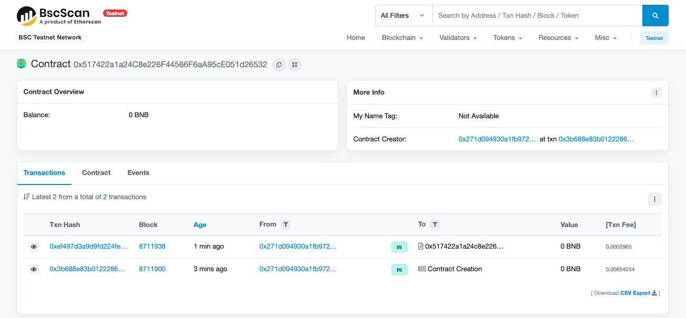
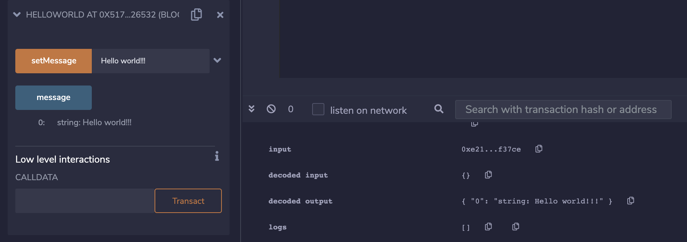

# Hello world contract on BSC using truffle

## Contract deploy
1. Install project dependencies `npm i`
1. Configure the mnemonic from the contract owner account on the file `config/default.json` in the same way that is on `test.json` file.
1. Run migration script `npm run migrate-bsc`

## Wallet configuration
1. Get some ether from [Binance faucet](https://testnet.binance.org/faucet-smart)
1. Switch to BSC testnet network on metamask - [instructions](https://academy.binance.com/es/articles/connecting-metamask-to-binance-smart-chain)

## Contract interaction using remix as UI
1. Open [remix](http://remix.ethereum.org/) and copy solidity contract file
1. Configure “Injected Web3” environment
1. Set deployed contract address on “At address”
1. Hit the button setMessage and approve transaction gas
1. Check updated message using message button

### Resources
* Taken ideas from [Julien Klepatch](https://github.com/jklepatch)
